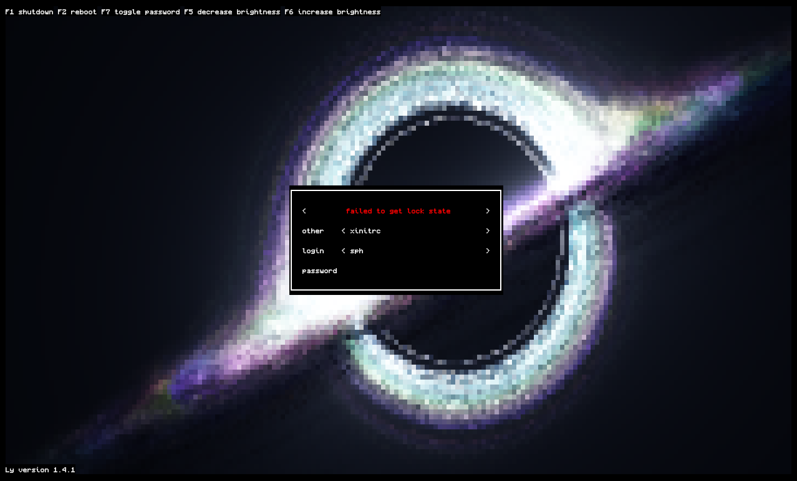
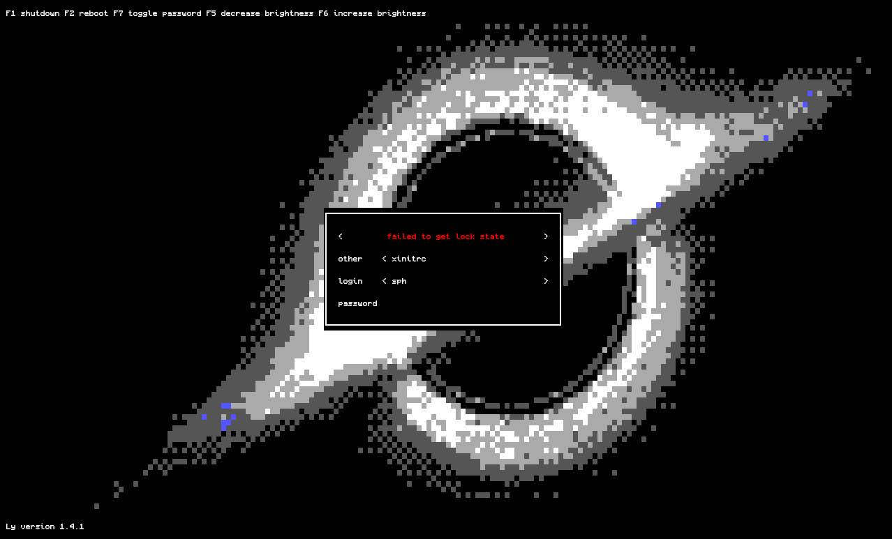
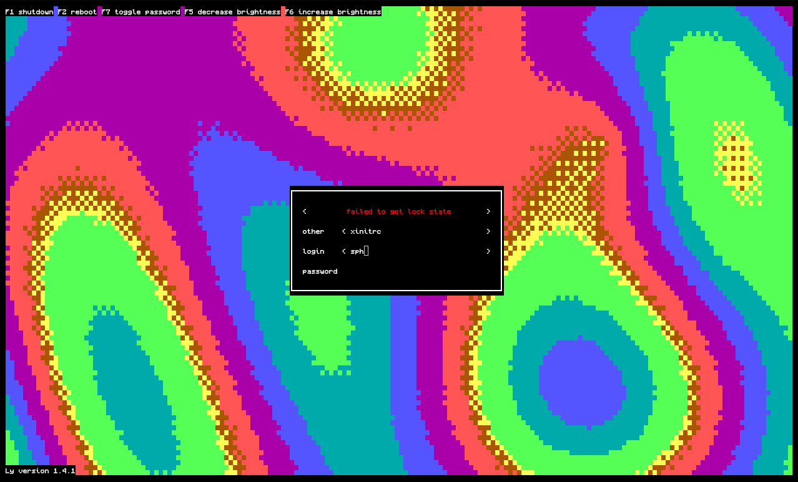

# nix-ly-themes

Animated shader themes for the [ly](https://codeberg.org/fairyglade/ly) TUI display manager, packaged as a Nix flake. Successor of [nix-ly-balatro-theme](https://github.com/sophronesis/nix-ly-balatro-theme).

Two source patches on top of stock ly:

- **`balatro`** - [Balatro](https://www.playbalatro.com)'s paint-swirl background as a built-in, pure-CPU animation (port of the **original shader by localthunk: <https://www.shadertoy.com/view/XXtBRr>**)
- **`shader`** - a generic animation that plays **any [shadertoy](https://www.shadertoy.com)-format fragment shader** (a plain `mainImage` file): rendered offscreen through EGL - mesa's llvmpipe on the CPU by default, GPU opt-in - and quantized to terminal cells with dithering. Ships with a single-pass port of **sonicether's "Gargantua With HDR Bloom" black hole (<https://www.shadertoy.com/view/lstSRS>)** and a classic plasma. A broken shader can't brick your login: any failure (bad GLSL, missing EGL stack) is logged and ly falls back to the balatro animation.

| | |
|---|---|
|  |  |
| *balatro: truecolor vs the VT's 16-color rendering* | *gargantua black hole, truecolor half-blocks* |
|  |  |
| *gargantua, dithered to the 16 VT colors (`halfblock16`)* | *plasma, `halfblock16`* |

## usage

Flake input + one module import:

```nix
{
  inputs.ly-themes.url = "github:sophronesis/nix-ly-themes";

  # in your nixosSystem modules:
  modules = [
    ly-themes.nixosModules.default
    {
      ly-themes.theme = "blackhole";                          # balatro (default) | blackhole | plasma | balatro-gl
      # ly-themes.gpu = "/dev/dri/by-path/pci-...-render";    # false (cpu/llvmpipe, default) | true | drm node path
    }
  ];
}
```

Importing the module enables `services.displayManager.ly` with the patched package and `full_color = true` (everything `mkDefault`, override freely; set `ly-themes.enable = false` to keep the module inert).

### bring your own shadertoy

Paste any image-only shadertoy into a file (or an inline string) - no edits needed, `mainImage` and the `iTime`/`iResolution`/`iDate`/... uniforms work as on the site:

```nix
ly-themes.shader = ./my-shadertoy.frag;   # or an inline GLSL string
```

What the shader animation provides:

- `iTime`, `iTimeDelta`, `iFrameRate`, `iFrame`, `iDate` (local time), `iResolution`, `iMouse` (zeros)
- `iChannel0`/`iChannel2` sample a built-in 256x256 RGBA noise texture (mipmapped, repeat - iq-style `noise()` functions work verbatim), `iChannel1`/`iChannel3` a smooth fbm texture as a stand-in for photo inputs
- single-pass only: multipass buffers aren't emulated (the black hole here is a single-pass port of a 5-pass original - dropping bloom passes costs nothing at terminal resolution)

### knobs

| option | default | meaning |
|---|---|---|
| `ly-themes.theme` | `"balatro"` | built-in theme; `balatro-gl` is the Balatro GLSL through the shader engine instead of the CPU port |
| `ly-themes.shader` | `null` | custom shadertoy-format shader (path or inline GLSL), overrides `theme` |
| `ly-themes.gpu` | `false` | `false` = llvmpipe on CPU, never opens a GPU (light shaders ~30% of one core; the black hole wants a GPU); `true` = mesa picks a render node (careful: on hybrid laptops that can wake the dGPU); `"/dev/dri/..."` = pin a card (by-path symlinks fine, ~5% of one core for the black hole on an iGPU) |
| `ly-themes.cellMode` | `"halfblock16"` | `halfblock16` = ▀ dithered to the 16 VT colors; `shade16` = ░▒▓█ blends (safest console glyphs); `halfblock` = truecolor (for kmscon/graphical terminals; the raw VT bands it) |
| `ly-themes.fps` | `30` | frame-rate cap; slow frames self-pace so typing stays responsive |
| `ly-themes.supersample` | `2` | shader renders at `(cells*S) x (cells*2*S)` px, box-filtered down |

Balatro colors stay runtime config (`0xRRGGBB`, `0x20000000` = termbox true black):

```nix
services.displayManager.ly.settings = {
  balatro_col1 = "0x00DE443B"; # paint 1
  balatro_col2 = "0x000055B4"; # paint 2
  balatro_col3 = "0x20000000"; # boundary paint
};
```

Alternatively take just the pieces:

- `overlays.default` - replaces `pkgs.ly` with the patched build
- `packages.<system>.ly` / `.default` - patched ly from this flake's pinned nixpkgs (`nixos-26.05`)
- `patches/ly-balatro.patch`, `patches/ly-shadertoy.patch` - plain `-p1` patches (shadertoy applies on top of balatro), `shaders/*.frag` - the bundled themes

The patches target **ly 1.4.1**. For ly 1.3.x use [nix-ly-balatro-theme](https://github.com/sophronesis/nix-ly-balatro-theme) (balatro only).

## how the shader engine works

- zero build/link dependencies for ly: the patch `dlopen`s the glvnd EGL dispatch library at runtime (`shader_egl_lib`, wired to `libglvnd` by the module) and resolves GL through `eglGetProcAddress`; on NixOS it exports `__EGL_VENDOR_LIBRARY_DIRS=/run/opengl-driver/share/glvnd/egl_vendor.d` itself when unset
- surfaceless EGL + ES 3.0 context, offscreen FBO at `(cells*S) x (cells*2*S)`, `glReadPixels`, then per-cell quantization (redmean nearest-color + ordered dithering)
- CPU-first: `shader_software = true` picks mesa's software device (llvmpipe) deterministically, so no GPU node is ever opened; `shader_drm_device` pins a specific card via `EGL_EXT_device_drm` when you do want one
- every failure path (no EGL library, no display, GLSL compile error with the compiler log, unreadable shader file) lands in the ly log and downgrades to the built-in balatro animation

## the `full_color` gotcha

ly's config migrator treats any config file **without an explicit `full_color` key** as predating truecolor support and silently demotes the whole greeter to 8-color mode, mangling every 24-bit color value through `&0xF`. The NixOS ly module doesn't set the key by default. This flake's module sets `full_color = true`; keep it if you write your own settings block.

## credits & license

- Balatro shader: [localthunk](https://www.playbalatro.com) - <https://www.shadertoy.com/view/XXtBRr>. Shadertoy's default license is CC BY-NC-SA 3.0; the `Balatro.zig` animation and `shaders/balatro.frag` are derivatives and keep that license
- Black hole: "Gargantua With HDR Bloom" by [sonicether](https://www.shadertoy.com/user/sonicether) - <https://www.shadertoy.com/view/lstSRS> (CC BY-NC-SA 3.0); `shaders/blackhole.frag` is a single-pass adaptation (noise `textureLod` helper by iq)
- [ly](https://codeberg.org/fairyglade/ly) is WTFPL; the patches, module and scaffolding here are WTFPL too
